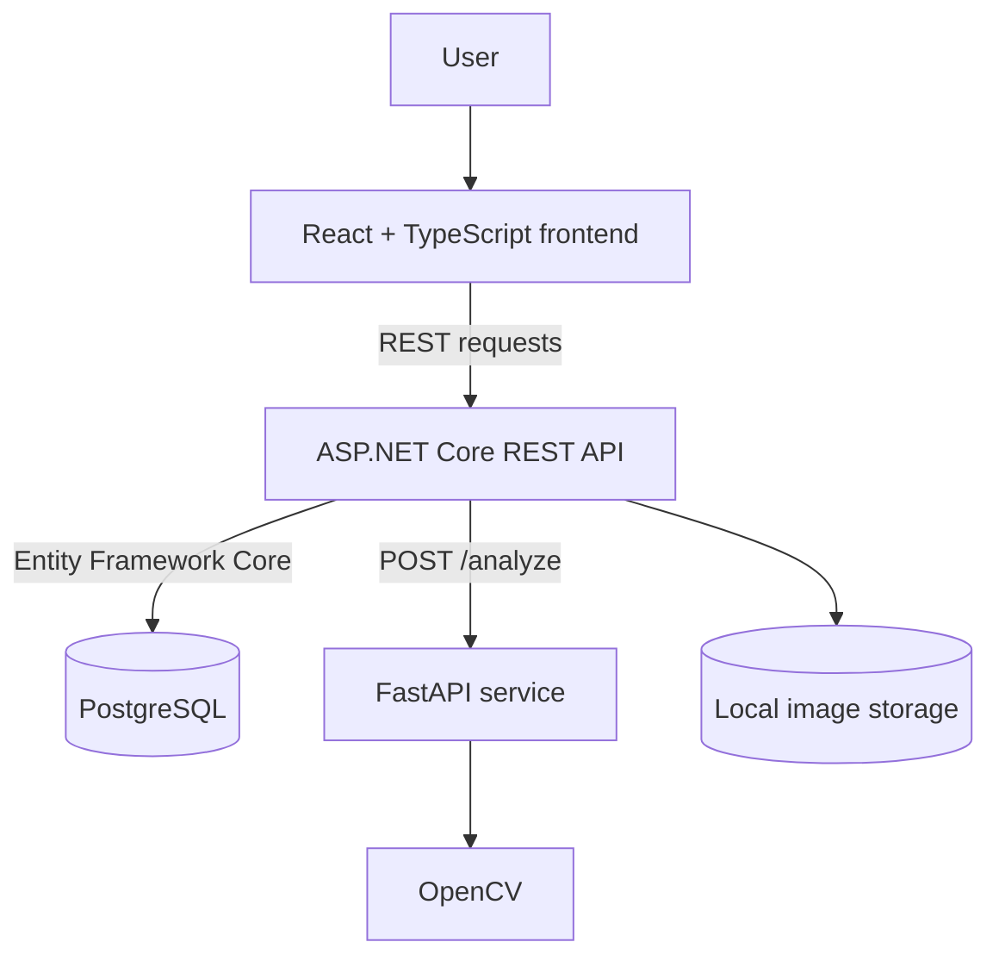
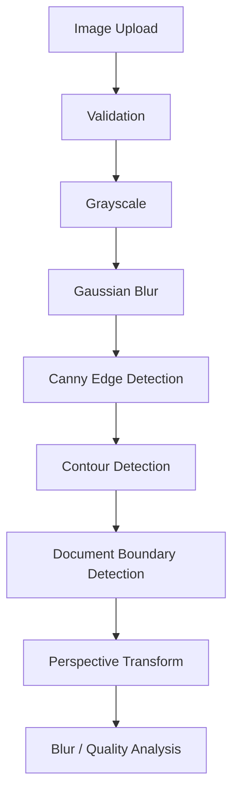
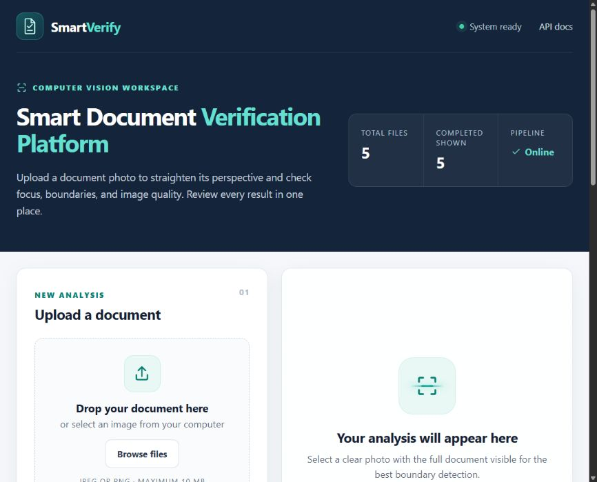
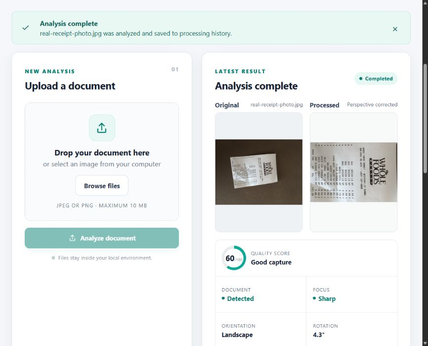

# Smart Document Verification Platform

## Overview

Smart Document Verification Platform turns a document photo into a cleaner image and reports whether the capture is usable. A React dashboard sends JPEG or PNG images to an ASP.NET Core API, which validates the upload and calls a separate FastAPI/OpenCV service. The service looks for a four-corner page boundary, corrects perspective when possible, and measures blur and image quality. PostgreSQL stores the processing history and results, while original and processed images are kept on local disk. This is an image-processing demo, not a document-authenticity or identity-verification system.

## Features

- Upload a JPEG or PNG (up to 10 MB) by file picker or drag and drop, with a preview before analysis.
- Detect a document boundary and straighten a photographed page when a suitable four-corner contour is found; otherwise retain the original framing.
- Show original and processed images, boundary detection, blur detection, a heuristic quality score, orientation, estimated rotation when available, and processing time.
- Browse, refresh, select, and delete processing-history records stored in PostgreSQL.
- Show loading, success, and validation/error states in a responsive dashboard.
- Explore the ASP.NET Core API in Swagger and the computer-vision service in FastAPI's generated docs.

## Technology Stack

| Part | Technology |
|---|---|
| Frontend | React, TypeScript, Vite |
| Backend | ASP.NET Core Web API, .NET 8, Entity Framework Core |
| Computer vision | Python, FastAPI, OpenCV |
| Database | PostgreSQL |

## Architecture

The browser calls the ASP.NET Core API. The API coordinates validation, persistence, image storage, and the FastAPI request; the browser does not call FastAPI directly. See [architecture details](docs/architecture.md).

## Computer Vision Pipeline

The perspective transform runs only when a suitable boundary is found. Blur detection uses Laplacian variance; the quality score combines sharpness, exposure, contrast, and boundary detection. These are explainable image heuristics, not machine-learning predictions.

## Screenshots

Captured from the running local application with a sample store receipt. No personal identity document or secret appears in these images.

| Upload workspace | Completed analysis |
|---|---|
|  |  |

| View | Screenshot |
|---|---|
| Main upload page | [View](docs/screenshots/home-page.png) |
| Document selected before processing | [View](docs/screenshots/selected-document.png) |
| Successful processed result | [View](docs/screenshots/upload-result.png) |
| Original and processed document | [View](docs/screenshots/processed-document.png) |
| Analysis results | [View](docs/screenshots/analysis-results.png) |
| Processing history | [View](docs/screenshots/processing-history.png) |
| ASP.NET Core Swagger UI | [View](docs/screenshots/swagger.png) |
| FastAPI docs | [View](docs/screenshots/fastapi-docs.png) |

## API

The public REST API runs at http://localhost:5000. Uploads use multipart/form-data with a field named file.

| Method | Endpoint | Purpose |
|---|---|---|
| POST | /api/documents | Upload and analyze an image; returns 201 with the result |
| GET | /api/documents?skip=0&take=20 | List history, newest first |
| GET | /api/documents/{id} | Get one result |
| GET | /api/documents/{id}/original | Read the uploaded image |
| GET | /api/documents/{id}/processed | Read the processed JPEG |
| DELETE | /api/documents/{id} | Delete the record and its stored images; returns 204 |
| GET | /health/live | Check API liveness |
| GET | /health/ready | Check PostgreSQL and computer-vision connectivity |

The API calls FastAPI's internal POST /analyze endpoint; FastAPI also exposes GET /health. See the [API reference](docs/api.md), [Swagger UI](http://localhost:5000/swagger/index.html), and [FastAPI docs](http://localhost:8000/docs).

## Running Locally

Use Windows PowerShell from the repository root. Docker is not required. Prerequisites are the .NET 8 SDK, Python 3.12, and Node.js 20.19.x or 22.12+ with npm (as required by the installed Vite version). PostgreSQL 16 can be installed already, or the included script can download a checksum-verified portable copy into this project.

### One-time setup

~~~powershell
Copy-Item .env.example .env
notepad .env
~~~

Replace the POSTGRES_PASSWORD placeholder with a private local password. The .env file is Git-ignored; never commit it. If using an existing PostgreSQL instance on port 5432, set POSTGRES_USER and POSTGRES_PASSWORD to an account that can create the development database. For a project-local PostgreSQL installation, run:

~~~powershell
.\scripts\Install-LocalPostgres.ps1
~~~

Install the application dependencies:

~~~powershell
$python = if (Test-Path .\.tools\python\python.exe) { '.\.tools\python\python.exe' } else { 'python' }
& $python -m venv .venv
.\.venv\Scripts\python.exe -m pip install -r .\cv-service\requirements-dev.txt
dotnet restore .\backend\SmartDocumentPlatform.sln
npm --prefix .\frontend ci
~~~

### Start the four services

Run each command from the repository root. Keep the FastAPI, backend, and frontend terminals open.

**Terminal 1 — PostgreSQL** (starts the local server and creates smart_document_db if needed):

~~~powershell
.\scripts\Start-LocalPostgres.ps1
~~~

**Terminal 2 — FastAPI/OpenCV** (http://localhost:8000):

~~~powershell
.\scripts\Start-CvService.ps1
~~~

**Terminal 3 — ASP.NET Core** (http://localhost:5000):

~~~powershell
.\scripts\Start-Backend.ps1
~~~

**Terminal 4 — React** (http://localhost:5173):

~~~powershell
.\scripts\Start-Frontend.ps1
~~~

Open the [dashboard](http://localhost:5173). The backend applies pending EF Core migrations when it starts. Check [backend readiness](http://localhost:5000/health/ready) if a service is unavailable. Stop the three foreground services with Ctrl+C; stop project-local PostgreSQL with:

~~~powershell
.\scripts\Stop-LocalPostgres.ps1
~~~

The project-local PostgreSQL binaries and data live under Git-ignored .tools and .local-data folders. The scripts temporarily map a drive letter only when the repository path contains non-ASCII characters. This local demo has no user accounts or access control, so keep the services on localhost.

## Testing

From PowerShell in the repository root, after the one-time dependency setup:

~~~powershell
dotnet test .\backend\SmartDocumentPlatform.sln --configuration Release
.\.venv\Scripts\python.exe -m pytest .\tests\cv-service
npm --prefix .\frontend run build
~~~

The .NET suite covers service validation and API behavior; pytest covers the OpenCV functions and FastAPI contract. The frontend command checks TypeScript and produces a Vite build. See the [verification record](docs/verification.md) for the latest local workflow checks.

## Project Structure

~~~text
smart-document-platform/
├── backend/
│   ├── src/SmartDocumentPlatform.Api/    # API, services, EF Core migrations
│   └── SmartDocumentPlatform.sln
├── cv-service/app/                        # FastAPI and OpenCV processing
├── frontend/src/                          # React dashboard
├── tests/
│   ├── backend/                            # .NET tests
│   └── cv-service/                         # Python tests
├── scripts/                                # Native Windows start/stop/setup
├── docs/                                   # Architecture, API, verification, screenshots
├── docker-compose.yml                      # Optional; not needed locally
└── .env.example                            # Safe configuration template
~~~

## Future Improvements

These are **FUTURE** work and are not part of the current application:

- **FUTURE:** Add OCR to extract text from processed pages.
- **FUTURE:** Add automatic masking of sensitive information.
- **FUTURE:** Store images in Azure Blob Storage.
- **FUTURE:** Deploy services and PostgreSQL on Azure with managed secrets and authentication.
- **FUTURE:** Evaluate ML-based document classification using a real dataset.

## Author

**Buğra Çakar** — Software Engineering Graduate

Licensed under [MIT](LICENSE). Contributions and local development notes are in [CONTRIBUTING.md](CONTRIBUTING.md).
