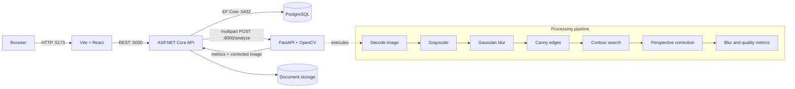

# Architecture

## Request flow

During native Windows development, all four services bind to local ports and CORS allows only the Vite origin. In the optional Docker Compose setup, PostgreSQL and the CV service communicate on the private Compose network. The API owns persistence and orchestration, which prevents the UI from depending on the internal CV response format.

## Backend responsibilities

| Component | Responsibility |
|---|---|
| `DocumentsController` | HTTP contracts and status codes |
| `DocumentService` | Upload, analysis, persistence, retrieval, and deletion workflow |
| `DocumentFileValidator` | Size, extension, media type, and file-signature checks |
| `ComputerVisionClient` | Typed multipart call and response mapping |
| `AppDbContext` | PostgreSQL mapping and query persistence |
| `IDocumentStorage` | Storage boundary for local files or a future Blob implementation |
| `ExceptionHandlingMiddleware` | Consistent problem responses and trace IDs |

EF Core's `DbContext` already behaves as a unit of work and each `DbSet` provides repository-style access. Adding a generic repository would mirror those APIs without separating a volatile dependency, so the application service uses the context directly.

## CV quality score

The score is a deterministic heuristic from 0 to 100:

| Signal | Weight | Interpretation |
|---|---:|---|
| Laplacian sharpness | 45% | Higher local edge variation generally means better focus |
| Exposure | 20% | Mean grayscale brightness is rewarded near the middle of the range |
| Contrast | 20% | Grayscale standard deviation rewards readable separation |
| Document boundary | 15% | A four-corner contour raises confidence in the capture |

This score is explainable and useful for capture feedback. It is not a trained model and does not claim authenticity or tamper detection.

## Azure mapping

| Local component | Azure-ready target | Required change |
|---|---|---|
| Backend container | Azure Container Apps or Linux App Service | Supply environment settings and managed identity |
| CV container | Azure Container Apps | Keep private ingress and allow calls from the backend |
| PostgreSQL container | Azure Database for PostgreSQL Flexible Server | Replace the connection string; run migrations during release |
| Named upload volume | Azure Blob Storage | Add an `IDocumentStorage` implementation using `BlobServiceClient` |
| Nginx frontend | Static Web Apps, Container Apps, or App Service | Set the public API route/origin |

For a cloud release, keep secrets in Key Vault, use workload identity where supported, enable HTTPS-only ingress, and add authentication before accepting sensitive documents.
